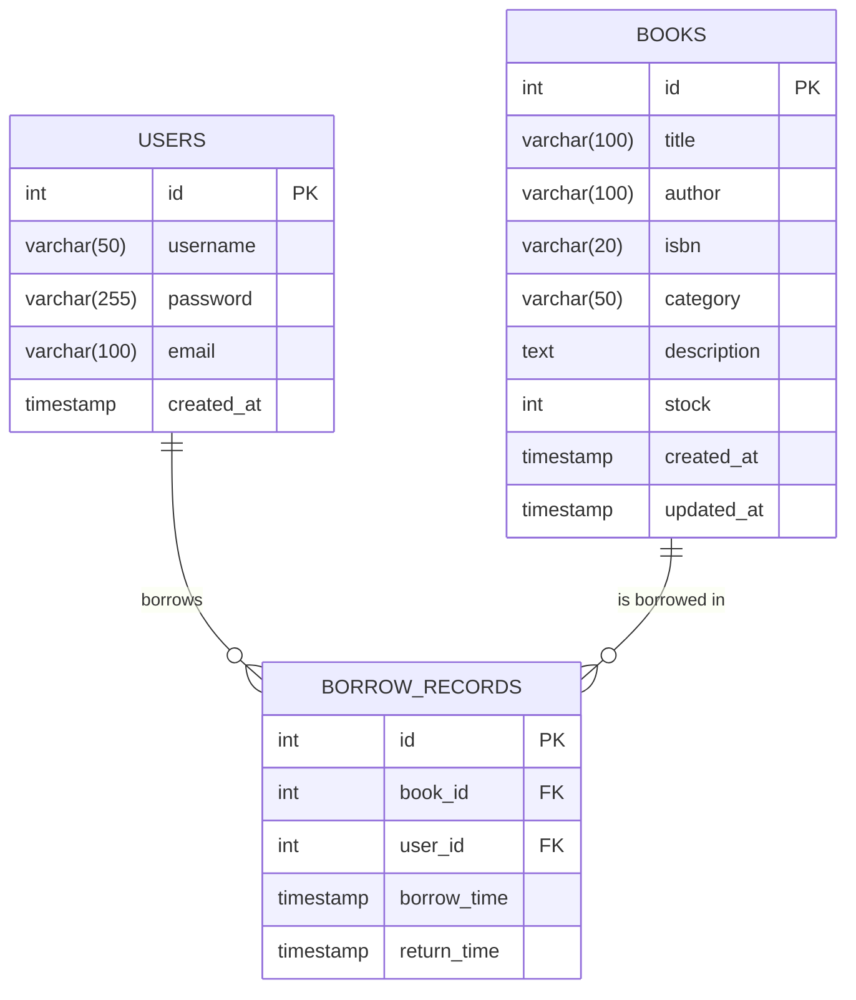

# 图书管理系统

## 项目简介

这是一个基于Vue 3 + Express.js开发的图书管理系统，具备用户注册登录、图书浏览与搜索、借阅归还等功能。系统采用前后端分离架构，前端使用Vue 3和Vite构建，后端使用Express.js提供RESTful API服务，数据存储使用MySQL数据库。

## 功能特性

### 用户管理
- 用户注册与登录
- JWT Token身份验证
- 密码加密存储（bcryptjs）

### 图书管理
- 图书浏览与搜索
- 按分类查看图书
- 图书详情展示

### 借阅管理
- 图书借阅
- 图书归还
- 借阅记录查看

## 技术栈

### 前端
- Vue 3 (Composition API)
- Vue Router 4
- Axios
- Vite
- CSS3 (自定义CSS变量主题)

### 后端
- Node.js
- Express.js
- MySQL2
- JSON Web Tokens (JWT)
- Bcrypt.js
- Cors

### 数据库
- MySQL

## 项目结构

```
book-system/
├── book-api/           # 后端服务
│   ├── app.js          # 主应用文件
│   ├── db.js           # 数据库连接配置
│   ├── package.json    # 后端依赖配置
│   └── ...             # 其他后端文件
└── book-frontend/      # 前端应用
    ├── src/            # 源代码目录
    ├── public/         # 静态资源目录
    ├── package.json    # 前端依赖配置
    └── ...             # 其他前端文件
```

## 安装和运行指南

### 环境要求
- Node.js >= 14.0.0
- MySQL >= 5.7
- npm 或 yarn

### 数据库配置
1. 创建MySQL数据库：
   ```sql
   CREATE DATABASE book_management_system;
   ```

2. 在数据库中执行以下SQL语句创建表：
   ```sql
   CREATE TABLE users (
     id INT AUTO_INCREMENT PRIMARY KEY,
     username VARCHAR(50) UNIQUE NOT NULL,
     password VARCHAR(255) NOT NULL,
     email VARCHAR(100) UNIQUE NOT NULL,
     created_at TIMESTAMP DEFAULT CURRENT_TIMESTAMP
   );
   
   CREATE TABLE books (
     id INT AUTO_INCREMENT PRIMARY KEY,
     title VARCHAR(255) NOT NULL,
     author VARCHAR(255) NOT NULL,
     isbn VARCHAR(20),
     category VARCHAR(100),
     description TEXT,
     stock INT DEFAULT 0,
     created_at TIMESTAMP DEFAULT CURRENT_TIMESTAMP,
     updated_at TIMESTAMP DEFAULT CURRENT_TIMESTAMP ON UPDATE CURRENT_TIMESTAMP
   );
   
   CREATE TABLE borrow_records (
     id INT AUTO_INCREMENT PRIMARY KEY,
     book_id INT,
     user_id INT,
     borrow_time TIMESTAMP DEFAULT CURRENT_TIMESTAMP,
     return_time TIMESTAMP NULL,
     FOREIGN KEY (book_id) REFERENCES books(id),
     FOREIGN KEY (user_id) REFERENCES users(id)
   );
   ```

### 后端服务配置和运行

1. 进入后端目录：
   ```bash
   cd book-api
   ```

2. 安装依赖：
   ```bash
   npm install
   ```

3. 创建 `.env` 文件并配置环境变量：
   ```env
   DB_HOST=localhost
   DB_USER=your_mysql_username
   DB_PASSWORD=your_mysql_password
   DB_NAME=book_management_system
   DB_PORT=3306
   JWT_SECRET=your_jwt_secret_key
   SERVER_PORT=3001
   ```

4. 启动后端服务：
   ```bash
   npm start
   ```

### 前端应用配置和运行

1. 进入前端目录：
   ```bash
   cd book-frontend
   ```

2. 安装依赖：
   ```bash
   npm install
   ```

3. 启动开发服务器：
   ```bash
   npm run dev
   ```

4. 打开浏览器访问 `http://localhost:5173`（默认端口）

### 构建生产版本

#### 前端构建
```bash
cd book-frontend
npm run build
```
构建后的文件将位于 `book-frontend/dist` 目录中。

## API接口文档

### 用户认证相关接口

#### 1. 用户注册
- **URL**: `/api/register`
- **方法**: `POST`
- **请求头**: `Content-Type: application/json`
- **请求参数**:
  ```json
  {
    "username": "用户名",
    "password": "密码（至少8位，包含字母和数字）",
    "email": "邮箱地址"
  }
  ```
- **响应成功**:
  ```json
  {
    "message": "注册成功"
  }
  ```
- **响应失败**:
  ```json
  {
    "error": "错误信息"
  }
  ```

#### 2. 用户登录
- **URL**: `/api/login`
- **方法**: `POST`
- **请求头**: `Content-Type: application/json`
- **请求参数**:
  ```json
  {
    "username": "用户名",
    "password": "密码"
  }
  ```
- **响应成功**:
  ```json
  {
    "message": "登录成功",
    "user": {
      "id": 1,
      "username": "用户名",
      "email": "邮箱地址"
    },
    "token": "JWT令牌"
  }
  ```
- **响应失败**:
  ```json
  {
    "error": "错误信息"
  }
  ```

### 图书相关接口

#### 1. 查询图书列表
- **URL**: `/api/books`
- **方法**: `GET`
- **查询参数**:
  - `keyword`: 搜索关键词（可选，按书名或作者搜索）
- **响应成功**:
  ```json
  [
    {
      "id": 1,
      "title": "书名",
      "author": "作者",
      "isbn": "ISBN编号",
      "category": "分类",
      "description": "描述",
      "stock": 10,
      "created_at": "2023-01-01T00:00:00.000Z",
      "updated_at": "2023-01-01T00:00:00.000Z"
    }
  ]
  ```

#### 2. 获取图书详情
- **URL**: `/api/books/:id`
- **方法**: `GET`
- **路径参数**:
  - `id`: 图书ID
- **响应成功**:
  ```json
  {
    "id": 1,
    "title": "书名",
    "author": "作者",
    "isbn": "ISBN编号",
    "category": "分类",
    "description": "描述",
    "stock": 10,
    "created_at": "2023-01-01T00:00:00.000Z",
    "updated_at": "2023-01-01T00:00:00.000Z"
  }
  ```

#### 3. 按分类查询图书
- **URL**: `/api/books/category`
- **方法**: `GET`
- **响应成功**:
  ```json
  [
    {
      "category": "分类名",
      "count": 5
    }
  ]
  ```

#### 4. 添加图书（需要认证）
- **URL**: `/api/books/add`
- **方法**: `POST`
- **请求头**: 
  - `Content-Type: application/json`
  - `Authorization: Bearer <token>`
- **请求参数**:
  ```json
  {
    "isbn": "ISBN编号",
    "title": "书名",
    "author": "作者",
    "category": "分类",
    "stock": 10,
    "publish_date": "2023-01-01"
  }
  ```
- **响应成功**:
  ```json
  {
    "message": "添加成功"
  }
  ```

#### 5. 编辑图书（需要认证）
- **URL**: `/api/books/:id`
- **方法**: `PUT`
- **请求头**: 
  - `Content-Type: application/json`
  - `Authorization: Bearer <token>`
- **路径参数**:
  - `id`: 图书ID
- **请求参数**:
  ```json
  {
    "isbn": "ISBN编号",
    "title": "书名",
    "author": "作者",
    "category": "分类",
    "stock": 10,
    "publish_date": "2023-01-01"
  }
  ```
- **响应成功**:
  ```json
  {
    "message": "更新成功"
  }
  ```

#### 6. 删除图书（需要认证）
- **URL**: `/api/books/:id`
- **方法**: `DELETE`
- **请求头**: 
  - `Authorization: Bearer <token>`
- **路径参数**:
  - `id`: 图书ID
- **响应成功**:
  ```json
  {
    "message": "删除成功"
  }
  ```

### 借阅相关接口

#### 1. 借阅图书
- **URL**: `/api/borrow`
- **方法**: `POST`
- **请求头**: 
  - `Content-Type: application/json`
  - `Authorization: Bearer <token>`
- **请求参数**:
  ```json
  {
    "bookId": 1,
    "userId": 1
  }
  ```
- **响应成功**:
  ```json
  {
    "message": "借阅成功"
  }
  ```

#### 2. 归还图书
- **URL**: `/api/return`
- **方法**: `POST`
- **请求头**: 
  - `Content-Type: application/json`
  - `Authorization: Bearer <token>`
- **请求参数**:
  ```json
  {
    "recordId": 1
  }
  ```
- **响应成功**:
  ```json
  {
    "message": "归还成功"
  }
  ```

#### 3. 查询用户借阅记录
- **URL**: `/api/borrow/user`
- **方法**: `GET`
- **请求头**: 
  - `Authorization: Bearer <token>`
- **响应成功**:
  ```json
  [
    {
      "id": 1,
      "book_id": 1,
      "user_id": 1,
      "borrow_time": "2023-01-01T00:00:00.000Z",
      "return_time": null,
      "title": "书名",
      "author": "作者"
    }
  ]
  ```

## 数据库设计说明

### ER图



### 表结构说明

#### Users表
存储系统用户信息：
- `id`: 用户ID，主键，自增
- `username`: 用户名，唯一
- `password`: 密码（加密存储）
- `email`: 邮箱，唯一
- `created_at`: 账户创建时间

#### Books表
存储图书信息：
- `id`: 图书ID，主键，自增
- `title`: 书名
- `author`: 作者
- `isbn`: ISBN编号
- `category`: 分类
- `description`: 描述
- `stock`: 库存数量
- `created_at`: 创建时间
- `updated_at`: 更新时间

#### Borrow_records表
存储借阅记录：
- `id`: 记录ID，主键，自增
- `book_id`: 图书ID，外键关联Books表
- `user_id`: 用户ID，外键关联Users表
- `borrow_time`: 借阅时间
- `return_time`: 归还时间（未归还时为NULL）

## 开发指南和贡献说明

### 项目开发规范

#### 前端开发规范
- 使用Vue 3 Composition API进行组件开发
- 组件文件命名采用PascalCase（大驼峰命名法）
- 组件内部按照 `<script setup>`, `<template>`, `<style>` 的顺序组织
- CSS类名使用kebab-case（短横线命名法）
- 使用Axios进行HTTP请求，统一在`src/utils/request.js`中配置
- 路由配置在`src/router/index.js`中管理
- 状态管理使用Vue的响应式API，复杂状态可考虑使用Pinia

#### 后端开发规范
- 使用Express.js框架开发RESTful API
- API路由统一在`app.js`中定义
- 数据库操作使用mysql2/promise驱动
- 密码加密使用bcryptjs库
- JWT Token用于用户身份验证
- 环境变量通过dotenv管理
- 错误处理使用try/catch结构

### 代码贡献流程

1. Fork项目到自己的GitHub账户
2. Clone Fork后的项目到本地
3. 创建新的功能分支：
   ```bash
   git checkout -b feature/your-feature-name
   ```
4. 进行代码开发和测试
5. 提交更改：
   ```bash
   git add .
   git commit -m "Add your feature description"
   ```
6. 推送到Fork的仓库：
   ```bash
   git push origin feature/your-feature-name
   ```
7. 在GitHub上创建Pull Request

### 项目扩展建议

#### 功能扩展
- 添加图书封面图片上传功能
- 实现图书评分和评论系统
- 增加管理员角色和权限管理
- 添加数据统计和报表功能
- 实现图书推荐算法

#### 性能优化
- 前端添加路由懒加载
- 后端实现数据库查询缓存
- 添加分页功能处理大量数据
- 使用CDN加速静态资源加载
- 实现API响应数据压缩

#### 安全性增强
- 添加请求频率限制（Rate Limiting）
- 实现更完善的输入验证和过滤
- 添加CSRF保护机制
- 使用HTTPS加密传输
- 定期更新依赖包修复安全漏洞