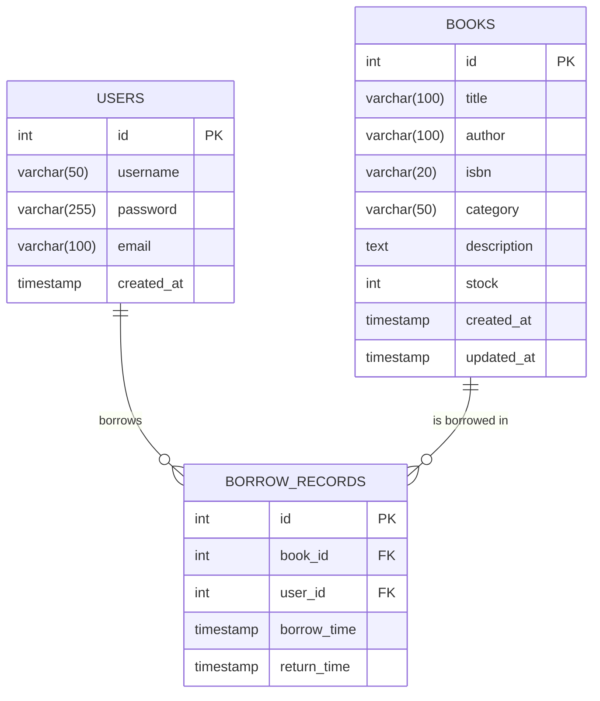

# 图书管理系统数据库设计

## ER图

## 表结构说明

### Users表
存储系统用户信息：
- `id`: 用户ID，主键，自增
- `username`: 用户名，唯一
- `password`: 密码（加密存储）
- `email`: 邮箱，唯一
- `created_at`: 账户创建时间

### Books表
存储图书信息：
- `id`: 图书ID，主键，自增
- `title`: 书名
- `author`: 作者
- `isbn`: ISBN编号
- `category`: 分类
- `description`: 描述
- `stock`: 库存数量
- `created_at`: 创建时间
- `updated_at`: 更新时间

### Borrow_records表
存储借阅记录：
- `id`: 记录ID，主键，自增
- `book_id`: 图书ID，外键关联Books表
- `user_id`: 用户ID，外键关联Users表
- `borrow_time`: 借阅时间
- `return_time`: 归还时间（未归还时为NULL）